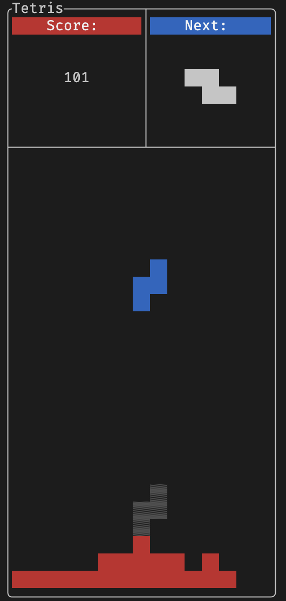

# Tetris

A TUI Tetris game wrote with C++ and [FTXUI](https://github.com/ArthurSonzogni/FTXUI) library.



## Features <a name = "feature"></a>

Features of Tetris can be found at [here](https://strategywiki.org/wiki/Tetris/Features). Features currently supported in this game:

- Lock delay
- Entry delay
- Next piece
- Ghost piece
- [Wall Kick](https://strategywiki.org/wiki/Tetris/Rotation_systems)

## Build <a name = "build"></a>

Dependencies are managed using [vcpkg](https://github.com/microsoft/vcpkg). Install vcpkg and run platform specific bootstrap before building.

For Unix:

```shell
git clone https://github.com/microsoft/vcpkg &&
./vcpkg/bootstrap-vcpkg.sh &&
./vcpkg/vcpkg install ftxui &&
mkdir build &&
cd build &&
cmake .. &&
cmake --build .
```
